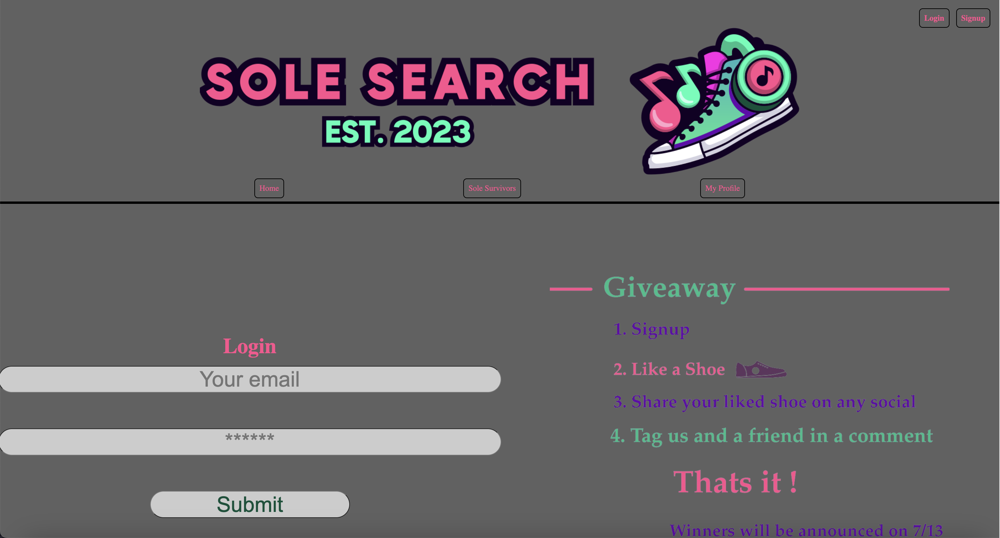
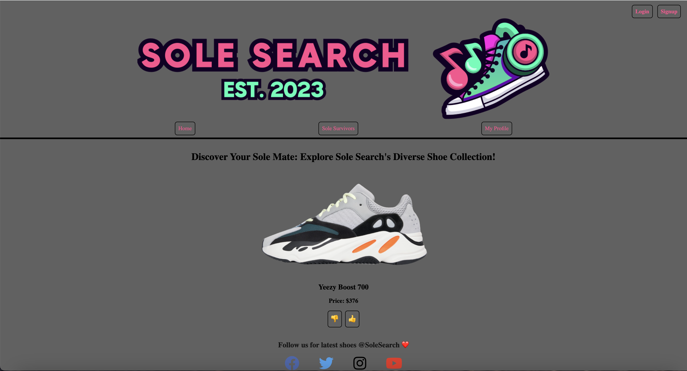
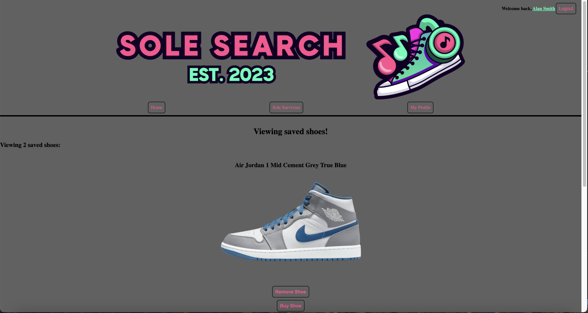
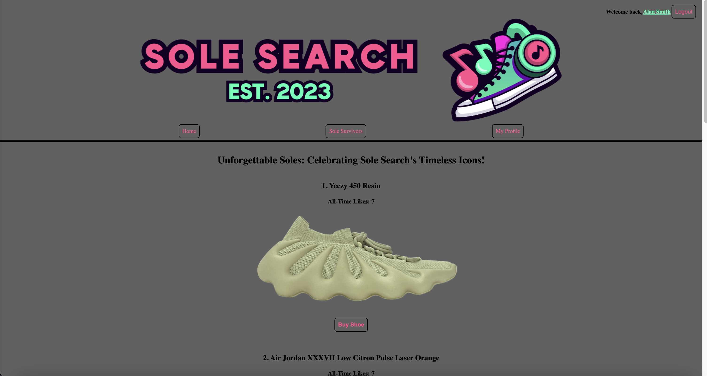

# Sole Search

## Description
This application allows users to scroll through an assortment of shoes and add shoes that they like to their profile. It was built using an Apollo server and GraphQL queries with MongoDB as the database. 

## Table of Contents

- [Installation](#installation)
- [Usage](#usage)
- [Technologies Used](#technologies-used)
- [Future Development Ideas](#future-development-ideas)
- [Credits](#credits)
- [License](#license)

## Installation
N/A

## Usage
A user must navigate to the website by clicking on the heroku link provided. Once there, the user will see a homepage which displays a shoe and a thumbs up and thumbs down button. In order to start swiping on these shoes, the user must first be logged in. 

If a user attempts to like or dislike a shoe while not logged in, then they will be redirected to the sign-up page. If logged in, when the user likes or dislikes the shoe, it will move to the next shoe until the user has swiped on all of the shoes available.  

If the user is logged in, they will have the option to view their "liked" shoes under the "My Profile" link. Users that are not logged in will be redirected to the sign-up page if they click on "My Profile". On this page, the user can view all of the shoes they have liked in the past. In addition, the user can also remove that shoe from their likes by clicking on the "remove" button or find a link to the shoe by clicking on "Buy Shoe".

The final link is the SoleSurvivor page. By clicking on this link, the user will see the top 5 shoes with the most likes. This page shows the like count of the top shoes and also gives the user a link to purchase that shoe. 

Below is a link to the deployed application:

https://sole-search-258e49665aec.herokuapp.com/

## Technologies Used 

- Apollo server and GraphQL
- MongoDB
- React
- Node.js
- Heroku

## Future Development Ideas

    1. Create and option to sort shoes by category

    2. Make a swipe feature on mobile instead of buttons

    3. Allow a user to add a shoe to the list

    4. Have the option to buy the shoe directly on the app

## Credits
N/A

## License
Please refer to the license in the repo.
